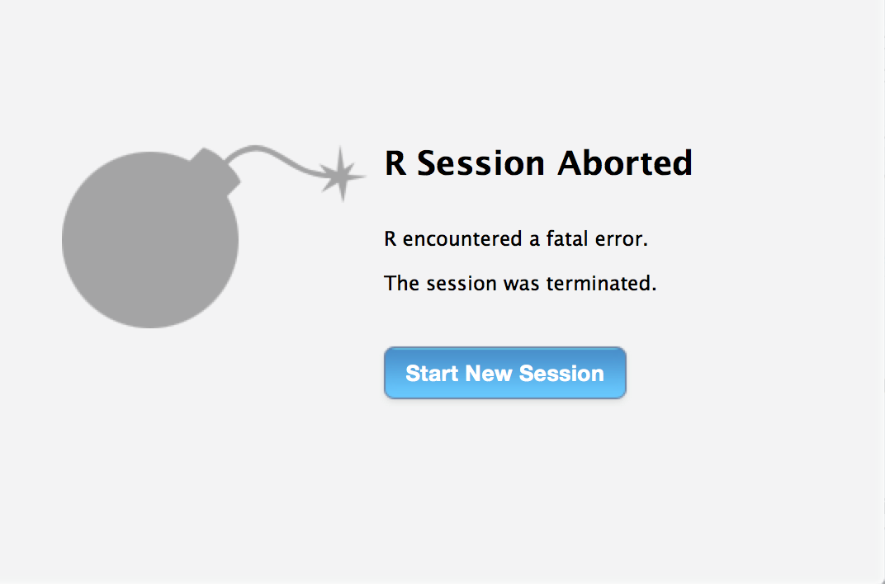

```{r setup, include=FALSE}
knitr::opts_chunk$set(echo = TRUE)
```

# Motivation

- R is a high-level interpeted scripting language (like python) which means R should be slower than C/C++
- R has an API for C, which is extended to C++ through the Rcpp package
- Having proficiency in both R and C++, it seemed logical to combine them
- Proficiency in interoperable code looks good on resume


# Background

- R is a functional language: Everything that exists in R is an object, and everything that happens in R is a function.
- R is interpreted, so code does not need to be compiled before it can run.
- Each R session is single-threaded, and cannot communicate with other R sessions or threads.
- C is an imperative language: Do A to B, then do D to E.
- C++ is an object-oriented extension of C: Do A's thing to A, do B's thing to B.
- C/C++ needs to be compiled before code can be run, and supports multiple threads.


# Combining R and C++

- Rcpp serves as a bridge between R and C++, allowing functions compiled in C++ to be run in R and to accept R objects as input/output, providing C++ functions that work like R functions, and offering C++ classes that R can interpret.
- RcppParallel provides thread-safe wrappers and parallelization functions that allow access and manipulation of R objects from multiple threads.


# Setbacks

- Design patterns that work well in R do not work well in C++, and vice versa, so melding these two language paradigms into code that compiles, runs accurately, and runs well requires patience and precision.  
- Running C++ through R does not provide diagnostics other than compiler errors.  For example, if an array is accessed out of bounds, R simply crashes with no message or explanation.  It is incumbent on the coder to discover what caused the crash, and where it occured.
- Running C++ through R provides no safety net the way IDEs such as NetBeans or VisualStudio do, meaning C++ run through R can actually be dangerous to a computer, particularly a Windows machine.
- Rccp wraps C++ for R, and RcppParallel wraps threaded C++ for Rcpp.  These two layers of wrapping means that writing multi-threaded C++ code that can run in R requires a nuanced understanding of the delicate workings that bind the three together.


# Features

- Two convenience wrappers to facilitate converions between the format used by the image manipulation package _magick_ and the raw hexadecimal matrices used by the package functions (*arr2magick* and _magick2arr_)
- An image scrambler written in optimized R code (*scrambler_R*)
- An image scrambler written in non-vectorized R code (*scrambler_naiveR*)
- An image scrambler written in _Rcpp_-enabled C++ that emulates R design ideals (*scrambler_Cpp2*)
- An image scrambler written in _Rcpp_-enabled C++ using object-oriented design ideals (*scrambler_Cpp*)


# Results

# Read in Images

To demonstrate _imageScrambleR_'s current capabilities, the following code loads a variety of images using the _magick_ package.
```{r loadImages}
r_logo_path <- file.path(R.home("doc"), "html", "logo.jpg")
base_image_path <- "D:/feana/Pictures/"
queen75_path <- paste0(base_image_path, "queen75.jpg")
muthur_path <- paste0(base_image_path, "muthur.png")
sephiroth_path <- paste0(base_image_path, "sephiroth_uhd.jpg")

library(magick)
r_logo <- image_read(r_logo_path)
print(r_logo)
```
```{r}
queen75 <- image_read(queen75_path)
print(queen75)
```
```{r}
muthur <- image_read(muthur_path)
print(muthur)
```
```{r}
sephiroth <- image_read(sephiroth_path)
print(sephiroth)
```


# Convert Images

The _magick2arr_ function is used to convert these images to grayscale, then to matrices with hexadecimal values for each pixel.
```{r}
# load imageScrambleR package
library(imageScrambleR)

r_logo_arr <- magick2arr(r_logo)
dim(r_logo_arr)
```
```{r}
r_logo_arr[1, 1:10]
```


# Convert Images (cont.)

```{r}
queen75_arr <- magick2arr(queen75)
dim(queen75_arr)
```
```{r}
muthur_arr <- magick2arr(muthur)
dim(muthur_arr)
```
```{r}
sephiroth_arr <- magick2arr(sephiroth)
dim(sephiroth_arr)
```


# Scrambling the Images

We can then use any of the four image scrambler functions to scramble each image using an integer to indicate how many chunks we want each dimension split into.
```{r}
r_logo_arr_scram <- scrambler_naiveR(r_logo_arr, 3L)
queen75_arr_scram <- scrambler_Cpp2(queen75_arr, 5L)
muthur_arr_scram <- scrambler_Cpp(muthur_arr, 7L)
sephiroth_arr_scram <- scrambler_R(sephiroth_arr, 9L)
```

Now we can use the _arr2magick_ function to convert them back to _magick_ image format, and view them.


# Scrambled R Logo

```{r}
r_logo_scram <- arr2magick(r_logo_arr_scram)
print(r_logo_scram)
```


# Scrambled Queen

```{r}
queen75_scram <- arr2magick(queen75_arr_scram)
print(queen75_scram)
```


# Scrambled MU-TH-UR 6000

```{r}
muthur_scram <- arr2magick(muthur_arr_scram)
print(muthur_scram)
```


# Scrambled Sephiroth

```{r}
sephiroth_scram <- arr2magick(sephiroth_arr_scram)
print(sephiroth_scram)
```


# Benchmarks

```{r benchmark_r, echo=TRUE, cache=TRUE}
benchmarks_r_logo <- microbenchmark::microbenchmark(
    scrambler_R(r_logo_arr, 3L),
    scrambler_naiveR(r_logo_arr, 3L),
    scrambler_Cpp2(r_logo_arr, 3L),
    scrambler_Cpp(r_logo_arr, 3L))
```
```{r benchmark_r2, echo=TRUE, cache=TRUE}
print(benchmarks_r_logo)
plot(benchmarks_r_logo, names = c('R', 'naiveR', 'Cpp2', 'Cpp'))
```

# Benchmarks (cont.)

```{r benchmark_q, echo=TRUE, cache=TRUE}
benchmarks_queen75 <- microbenchmark::microbenchmark(
    scrambler_R(queen75_arr, 5L),
    scrambler_naiveR(queen75_arr, 5L),
    scrambler_Cpp2(queen75_arr, 5L),
    scrambler_Cpp(queen75_arr, 5L))
```
```{r benchmark_q2, echo=TRUE, cache=TRUE}
print(benchmarks_queen75)
plot(benchmarks_queen75, names = c('R', 'naiveR', 'Cpp2', 'Cpp'))
```

# Benchmarks (cont.)

```{r benchmark_m, echo=TRUE, cache=TRUE}
benchmarks_muthur <- microbenchmark::microbenchmark(
    scrambler_R(muthur_arr, 7L),
    scrambler_naiveR(muthur_arr, 7L),
    scrambler_Cpp2(muthur_arr, 7L),
    scrambler_Cpp(muthur_arr, 7L))
```
```{r benchmark_m2, echo=TRUE, cache=TRUE}
print(benchmarks_muthur)
plot(benchmarks_muthur, names = c('R', 'naiveR', 'Cpp2', 'Cpp'))
```

# Benchmarks (cont.)

```{r benchmark_s, echo=TRUE, cache=TRUE}
benchmarks_sephiroth <- microbenchmark::microbenchmark(
    scrambler_R(sephiroth_arr, 9L),
    scrambler_naiveR(sephiroth_arr, 9L),
    scrambler_Cpp2(sephiroth_arr, 9L),
    scrambler_Cpp(sephiroth_arr, 9L))
```
```{r benchmark_s2, echo=TRUE, cache=TRUE}
print(benchmarks_sephiroth)
plot(benchmarks_sephiroth, names = c('R', 'naiveR', 'Cpp2', 'Cpp'))
```


# Questions?


# Further Thoughts

- When used properly, R's vector optimizations are surprisingly fast.
- Trying to combine R paradigms with C++ paradigms is a task as difficult as writing an eloquent poem about a math equation.
- Trying to write multi-threaded C++ code through RcppParallel, Rcpp, and R is something like building a ship in a bottle while wearing a blindfold.  All the pieces need to be placed just so, but there's no way to see if they are until it's done and it either looks decent, or crashes.
- I became very accustomed to this image:
```{r echo=FALSE, out.width='100%'}

```

# What did I mean by "dangerous to a computer"?

Some of the compiled C++ code from an R package utilized by another project I was previously part of caused a conflict with a cloud-based file syncing service.  This conflict created a corrupted operating system pointer.  The established methods to correct these problems instead compounded them, causing the issue to snowball, resulting in me spending three days restoring the operating system multiple times, and losing far more time as a software development workflow environment that had been built up over the course of several years needed to be rebuilt piece by piece.
